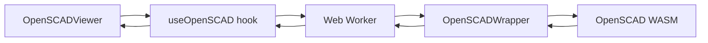
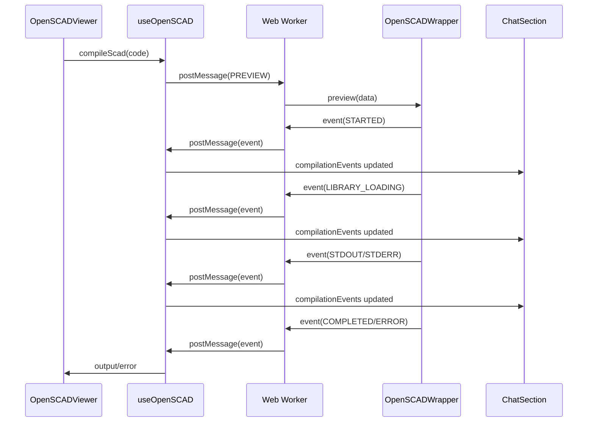

# OpenSCAD Streaming Events & Enhanced Error Reporting Plan

## Overview

Replace the static spinner during OpenSCAD compilation with real-time streaming compilation events in the chat window, and dramatically improve error reporting to make it educational and copy-pasteable.

## Current Architecture Analysis

### Compilation Flow



### Current Issues

1. **No Progress Feedback**: Only shows generic "Compiling..." spinner
2. **Poor Error UX**: Errors are not easily readable or copyable
3. **No Context**: Users don't know what stage of compilation is happening
4. **Limited Learning**: Error messages don't help users understand OpenSCAD

### Key Files

- [`src/hooks/useOpenSCAD.ts`](../src/hooks/useOpenSCAD.ts) - Main compilation hook
- [`src/worker/worker.ts`](../src/worker/worker.ts) - Worker message handler
- [`src/worker/openSCAD.ts`](../src/worker/openSCAD.ts) - OpenSCAD wrapper with logger
- [`src/lib/OpenSCADError.ts`](../src/lib/OpenSCADError.ts) - Error class
- [`src/components/chat/AssistantLoading.tsx`](../src/components/chat/AssistantLoading.tsx) - Chat loading state
- [`src/components/viewer/OpenSCADViewer.tsx`](../src/components/viewer/OpenSCADViewer.tsx) - Viewer with error display

## Solution Design

### 1. Event Streaming Architecture

#### New Event Types

Create comprehensive event system in [`src/worker/types.ts`](../src/worker/types.ts):

```typescript
export enum CompilationEventType {
  STARTED = 'compilation.started',
  PARSING = 'compilation.parsing',
  LIBRARY_LOADING = 'compilation.library_loading',
  LIBRARY_LOADED = 'compilation.library_loaded',
  STDOUT = 'compilation.stdout',
  STDERR = 'compilation.stderr',
  RENDERING = 'compilation.rendering',
  EXPORTING = 'compilation.exporting',
  COMPLETED = 'compilation.completed',
  ERROR = 'compilation.error',
}

export type CompilationEvent = {
  type: CompilationEventType;
  timestamp: number;
  data?: {
    message?: string;
    library?: string;
    progress?: number;
    line?: string;
    isError?: boolean;
  };
};
```

#### Worker Event Emission

Modify [`src/worker/openSCAD.ts`](../src/worker/openSCAD.ts) to emit events:

**Key Changes:**

- Emit event when compilation starts
- Emit events during library loading (each library)
- Intercept stdout/stderr and emit line-by-line
- Emit progress during rendering phases
- Emit completion or error events

```typescript
class OpenSCADWrapper {
  private emitEvent(event: CompilationEvent): void {
    self.postMessage({
      type: 'compilation.event',
      event,
    });
  }

  async executeOpenscad(...) {
    this.emitEvent({
      type: CompilationEventType.STARTED,
      timestamp: Date.now(),
      data: { message: 'Starting compilation...' }
    });

    // During library loading
    for (const library of libraries) {
      this.emitEvent({
        type: CompilationEventType.LIBRARY_LOADING,
        timestamp: Date.now(),
        data: { library: library.name }
      });
      // ... load library ...
      this.emitEvent({
        type: CompilationEventType.LIBRARY_LOADED,
        timestamp: Date.now(),
        data: { library: library.name }
      });
    }

    // Emit stdout/stderr as they arrive
    // ...
  }
}
```

#### Enhanced Logger

Update logger to emit real-time events:

```typescript
logger = (type: 'stdErr' | 'stdOut') => (text: string) => {
  this.log[type].push(text);

  // Emit event for real-time streaming
  this.emitEvent({
    type:
      type === 'stdErr'
        ? CompilationEventType.STDERR
        : CompilationEventType.STDOUT,
    timestamp: Date.now(),
    data: {
      line: text,
      isError: type === 'stdErr',
    },
  });
};
```

### 2. Hook Event Handling

Update [`src/hooks/useOpenSCAD.ts`](../src/hooks/useOpenSCAD.ts):

```typescript
export function useOpenSCAD() {
  const [compilationEvents, setCompilationEvents] = useState<
    CompilationEvent[]
  >([]);

  const eventHandler = useCallback((event: MessageEvent) => {
    const { type } = event.data;

    // Handle compilation events
    if (type === 'compilation.event') {
      const compilationEvent = event.data.event as CompilationEvent;
      setCompilationEvents((prev) => [...prev, compilationEvent]);
      return;
    }

    // ... existing preview/export handling ...
  }, []);

  const compileScad = useCallback(async (code: string) => {
    setIsCompiling(true);
    setCompilationEvents([]); // Reset events
    // ... rest of implementation
  }, []);

  return {
    // ... existing returns
    compilationEvents,
  };
}
```

### 3. Chat Window Integration

#### Create CompilationProgress Component

New file: [`src/components/chat/CompilationProgress.tsx`](../src/components/chat/CompilationProgress.tsx)

```typescript
interface CompilationProgressProps {
  events: CompilationEvent[];
}

export function CompilationProgress({ events }: CompilationProgressProps) {
  const lastEvent = events[events.length - 1];
  const librariesLoading = events.filter(e =>
    e.type === CompilationEventType.LIBRARY_LOADING
  ).length;
  const librariesLoaded = events.filter(e =>
    e.type === CompilationEventType.LIBRARY_LOADED
  ).length;

  return (
    <div className="flex w-full flex-col gap-2 p-3">
      <div className="flex items-center gap-2">
        <Loader2 className="h-4 w-4 animate-spin text-adam-blue" />
        <span className="text-sm font-medium text-adam-text-primary">
          {getStatusMessage(lastEvent)}
        </span>
      </div>

      {/* Progress indicators */}
      {librariesLoading > 0 && (
        <div className="text-xs text-adam-text-primary/70">
          Loading libraries: {librariesLoaded}/{librariesLoading}
        </div>
      )}

      {/* Live console output */}
      <CompilationConsole events={events} />
    </div>
  );
}

function getStatusMessage(event?: CompilationEvent): string {
  switch(event?.type) {
    case CompilationEventType.PARSING:
      return 'Parsing OpenSCAD code...';
    case CompilationEventType.LIBRARY_LOADING:
      return `Loading ${event.data?.library}...`;
    case CompilationEventType.RENDERING:
      return 'Rendering geometry...';
    case CompilationEventType.EXPORTING:
      return 'Exporting model...';
    default:
      return 'Compiling...';
  }
}
```

#### Compilation Console Component

New file: [`src/components/chat/CompilationConsole.tsx`](../src/components/chat/CompilationConsole.tsx)

```typescript
export function CompilationConsole({ events }: { events: CompilationEvent[] }) {
  const consoleRef = useRef<HTMLDivElement>(null);

  const consoleLines = events.filter(e =>
    e.type === CompilationEventType.STDOUT ||
    e.type === CompilationEventType.STDERR
  );

  // Auto-scroll to bottom
  useEffect(() => {
    if (consoleRef.current) {
      consoleRef.current.scrollTop = consoleRef.current.scrollHeight;
    }
  }, [consoleLines]);

  if (consoleLines.length === 0) return null;

  return (
    <div
      ref={consoleRef}
      className="max-h-32 overflow-y-auto rounded-md bg-adam-neutral-950/50 p-2 font-mono text-xs"
    >
      {consoleLines.map((event, i) => (
        <div
          key={i}
          className={cn(
            'whitespace-pre-wrap',
            event.data?.isError
              ? 'text-red-400'
              : 'text-green-400/70'
          )}
        >
          {event.data?.line}
        </div>
      ))}
    </div>
  );
}
```

#### Update ChatSection

Modify [`src/components/chat/ChatSection.tsx`](../src/components/chat/ChatSection.tsx):

```typescript
import { CompilationProgress } from '@/components/chat/CompilationProgress';
import { useOpenSCAD } from '@/hooks/useOpenSCAD';

export function ChatSection({ messages }: ChatSectionProps) {
  const { compilationEvents, isCompiling } = useOpenSCAD();

  return (
    // ... existing layout
    {isLoading && lastMessage?.role !== 'assistant' && (
      <div className="flex w-full p-1">
        <div className="mr-2 mt-1">
          <Avatar className="h-9 w-9 border border-adam-neutral-700 bg-adam-neutral-950 p-1.5">
            <AvatarImage src={`${import.meta.env.BASE_URL}/adam-logo.svg`} alt="Adam" />
          </Avatar>
        </div>
        <div className="max-w-[80%] rounded-lg bg-adam-neutral-800">
          {isCompiling && compilationEvents.length > 0 ? (
            <CompilationProgress events={compilationEvents} />
          ) : (
            <div className="flex flex-col items-center justify-center gap-2 p-3">
              <AnimatedEllipsis color="adam-neutral" />
            </div>
          )}
        </div>
      </div>
    )}
  );
}
```

### 4. Enhanced Error Reporting

#### Improved OpenSCADError Class

Update [`src/lib/OpenSCADError.ts`](../src/lib/OpenSCADError.ts):

```typescript
class OpenSCADError extends Error {
  code: string;
  stdErr: string[];
  stdOut: string[];
  parsedErrors: ParsedError[];

  constructor(
    message: string,
    code: string,
    stdErr: string[],
    stdOut: string[] = [],
  ) {
    super(message);
    this.code = code;
    this.stdErr = stdErr;
    this.stdOut = stdOut;
    this.parsedErrors = this.parseErrors();
  }

  private parseErrors(): ParsedError[] {
    // Parse stderr for structured error information
    // Example: "ERROR: Parser error in line 10: syntax error"
    const errors: ParsedError[] = [];

    const errorRegex = /ERROR:\s+(.+?)(?:in line (\d+))?(?:: (.+))?/gi;
    const warningRegex = /WARNING:\s+(.+?)(?:in line (\d+))?(?:: (.+))?/gi;

    this.stdErr.forEach((line) => {
      let match;
      if ((match = errorRegex.exec(line))) {
        errors.push({
          type: 'error',
          message: match[3] || match[1],
          line: match[2] ? parseInt(match[2]) : undefined,
          rawLine: line,
        });
      } else if ((match = warningRegex.exec(line))) {
        errors.push({
          type: 'warning',
          message: match[3] || match[1],
          line: match[2] ? parseInt(match[2]) : undefined,
          raw: line,
        });
      }
    });

    return errors;
  }

  toFormattedString(): string {
    // Format for easy copy-paste
    return [
      '=== OpenSCAD Compilation Error ===',
      '',
      ...this.parsedErrors.map(
        (err) =>
          `${err.type.toUpperCase()}: ${err.message}${err.line ? ` (line ${err.line})` : ''}`,
      ),
      '',
      '=== Full Output ===',
      ...this.stdErr,
      '',
      '=== Stdout ===',
      ...this.stdOut,
    ].join('\n');
  }
}

type ParsedError = {
  type: 'error' | 'warning';
  message: string;
  line?: number;
  rawLine: string;
};
```

#### Enhanced Error Display Component

New file: [`src/components/viewer/OpenSCADErrorDisplay.tsx`](../src/components/viewer/OpenSCADErrorDisplay.tsx)

```typescript
import { useState } from 'react';
import { Copy, Check, ChevronDown, ChevronUp } from 'lucide-react';
import OpenSCADError from '@/lib/OpenSCADError';
import { Button } from '@/components/ui/button';
import { cn } from '@/lib/utils';

interface OpenSCADErrorDisplayProps {
  error: OpenSCADError;
  onFixWithAI?: () => void;
}

export function OpenSCADErrorDisplay({
  error,
  onFixWithAI
}: OpenSCADErrorDisplayProps) {
  const [copied, setCopied] = useState(false);
  const [expanded, setExpanded] = useState(false);

  const handleCopy = async () => {
    await navigator.clipboard.writeText(error.toFormattedString());
    setCopied(true);
    setTimeout(() => setCopied(false), 2000);
  };

  return (
    <div className="flex h-full flex-col gap-4 p-6">
      {/* Error Summary */}
      <div className="flex flex-col gap-3">
        <div className="flex items-center justify-between">
          <h3 className="text-lg font-semibold text-adam-blue">
            Compilation Error
          </h3>
          <Button
            variant="ghost"
            size="sm"
            onClick={handleCopy}
            className="gap-2"
          >
            {copied ? (
              <>
                <Check className="h-4 w-4" />
                Copied!
              </>
            ) : (
              <>
                <Copy className="h-4 w-4" />
                Copy Error
              </>
            )}
          </Button>
        </div>

        {/* Parsed Errors */}
        {error.parsedErrors.length > 0 && (
          <div className="space-y-2">
            {error.parsedErrors.slice(0, 3).map((err, i) => (
              <div
                key={i}
                className={cn(
                  'rounded-lg border p-3',
                  err.type === 'error'
                    ? 'border-red-500/30 bg-red-500/10'
                    : 'border-yellow-500/30 bg-yellow-500/10'
                )}
              >
                <div className="flex items-start gap-2">
                  <span
                    className={cn(
                      'rounded px-1.5 py-0.5 text-xs font-semibold',
                      err.type === 'error'
                        ? 'bg-red-500 text-white'
                        : 'bg-yellow-500 text-black'
                    )}
                  >
                    {err.type.toUpperCase()}
                  </span>
                  {err.line && (
                    <span className="text-xs text-adam-text-primary/60">
                      Line {err.line}
                    </span>
                  )}
                </div>
                <p className="mt-2 font-mono text-sm text-adam-text-primary">
                  {err.message}
                </p>
              </div>
            ))}
          </div>
        )}

        {/* Expandable Full Output */}
        <div className="rounded-lg border border-adam-neutral-700 bg-adam-neutral-950/50">
          <button
            onClick={() => setExpanded(!expanded)}
            className="flex w-full items-center justify-between p-3 text-left hover:bg-adam-neutral-900/50"
          >
            <span className="text-sm font-medium text-adam-text-primary">
              Full Compiler Output
            </span>
            {expanded ? (
              <ChevronUp className="h-4 w-4" />
            ) : (
              <ChevronDown className="h-4 w-4" />
            )}
          </button>

          {expanded && (
            <div className="max-h-96 overflow-y-auto border-t border-adam-neutral-700 p-3">
              <div className="space-y-2 font-mono text-xs">
                {error.stdErr.length > 0 && (
                  <div>
                    <div className="mb-1 text-red-400 font-semibold">
                      STDERR:
                    </div>
                    {error.stdErr.map((line, i) => (
                      <div key={i} className="text-red-400/80 whitespace-pre-wrap">
                        {line}
                      </div>
                    ))}
                  </div>
                )}

                {error.stdOut && error.stdOut.length > 0 && (
                  <div className="mt-3">
                    <div className="mb-1 text-green-400 font-semibold">
                      STDOUT:
                    </div>
                    {error.stdOut.map((line, i) => (
                      <div key={i} className="text-green-400/70 whitespace-pre-wrap">
                        {line}
                      </div>
                    ))}
                  </div>
                )}
              </div>
            </div>
          )}
        </div>
      </div>

      {/* Fix with AI Button */}
      {onFixWithAI && (
        <Button
          onClick={onFixWithAI}
          className={cn(
            'w-full gap-2 bg-gradient-to-br from-adam-blue/20 to-adam-neutral-800/70',
            'border border-adam-blue/30 hover:border-adam-blue/70',
            'hover:bg-adam-blue/50'
          )}
        >
          <Wrench className="h-4 w-4" />
          Fix with AI
        </Button>
      )}

      {/* Helpful Tips */}
      <div className="rounded-lg border border-adam-neutral-700 bg-adam-neutral-900/30 p-3">
        <h4 className="mb-2 text-sm font-semibold text-adam-text-primary">
          💡 Common Solutions
        </h4>
        <ul className="space-y-1 text-xs text-adam-text-primary/70">
          <li>• Check for missing semicolons or brackets</li>
          <li>• Verify variable names and module calls</li>
          <li>• Ensure library imports are correct</li>
          <li>• Review parameter types and values</li>
        </ul>
      </div>
    </div>
  );
}
```

#### Update OpenSCADViewer

Modify [`src/components/viewer/OpenSCADViewer.tsx`](../src/components/viewer/OpenSCADViewer.tsx):

```typescript
import { OpenSCADErrorDisplay } from './OpenSCADErrorDisplay';

export function OpenSCADViewer() {
  // ... existing code

  return (
    <div className="h-full w-full">
      {geometry ? (
        <ThreeScene geometry={geometry} />
      ) : (
        <>
          {isError && error && error.name === 'OpenSCADError' && (
            <OpenSCADErrorDisplay
              error={error as OpenSCADError}
              onFixWithAI={isLastMessage ? () => fixError(error as OpenSCADError) : undefined}
            />
          )}
        </>
      )}
      {/* Compilation overlay removed - now shown in chat */}
    </div>
  );
}
```

### 5. Worker Message Types Update

Update [`src/worker/types.ts`](../src/worker/types.ts):

```typescript
export type WorkerResponseMessage = {
  id: string | number;
  type: WorkerMessageType | 'compilation.event';
  data:
    | OpenSCADWorkerResponseData
    | FileSystemWorkerMessageData
    | boolean
    | null;
  event?: CompilationEvent; // Add event field
  err?: Error;
};
```

## Implementation Flow



## User Experience Improvements

### Before

```
Chat Window:
┌──────────────────────┐
│  User Message        │
│                      │
│  [Spinner] Loading...│  ← Generic, no context
└──────────────────────┘
```

### After

```
Chat Window:
┌────────────────────────────────────┐
│  User Message                      │
│                                    │
│  🤖 Compiling OpenSCAD Model       │
│  📚 Loading BOSL2...               │
│  🔨 Rendering geometry...          │
│                                    │
│  ┌─ Console Output ─────────────┐ │
│  │ Compiling design...          │ │
│  │ Parsing... done               │ │
│  │ CSG tree optimization...      │ │
│  └──────────────────────────────┘ │
└────────────────────────────────────┘
```

### Error Display Before

```
Viewer:
┌──────────────────┐
│   ⚠️ Error       │
│                  │
│ [Fix with AI]    │
└──────────────────┘
```

### Error Display After

```
Viewer:
┌─────────────────────────────────────────────┐
│  Compilation Error              [Copy]      │
│                                             │
│  ERROR: Syntax error at line 42             │
│  Missing semicolon after module definition  │
│                                             │
│  ▼ Full Compiler Output                     │
│  ┌─────────────────────────────────────┐   │
│  │ STDERR:                             │   │
│  │ ERROR: Parser error in line 42...   │   │
│  │ WARNING: Deprecated syntax...       │   │
│  │                                     │   │
│  │ STDOUT:                             │   │
│  │ Compiling design...                 │   │
│  └─────────────────────────────────────┘   │
│                                             │
│  [Fix with AI]                              │
│                                             │
│  💡 Common Solutions                        │
│  • Check for missing semicolons             │
│  • Verify module calls                      │
└─────────────────────────────────────────────┘
```

## Technical Considerations

### Performance

- **Event throttling**: Limit stdout/stderr events to max 10/second
- **Event batching**: Batch multiple lines into single events
- **Memory management**: Clear old events after compilation completes

### Error Handling

- Gracefully handle missing error information
- Provide fallback for unparseable errors
- Maintain backward compatibility with existing error handling

### Testing Strategy

1. Test with successful compilation
2. Test with syntax errors
3. Test with library loading
4. Test with 2D vs 3D objects
5. Test copy functionality across browsers
6. Test with long compilation times

## Migration Strategy

### Phase 1: Foundation (Non-breaking)

- Add event types to [`types.ts`](../src/worker/types.ts)
- Update [`OpenSCADError`](../src/lib/OpenSCADError.ts) with new methods
- Add event emission to worker (without breaking existing flow)

### Phase 2: UI Components

- Create [`CompilationProgress`](../src/components/chat/CompilationProgress.tsx)
- Create [`CompilationConsole`](../src/components/chat/CompilationConsole.tsx)
- Create [`OpenSCADErrorDisplay`](../src/components/viewer/OpenSCADErrorDisplay.tsx)

### Phase 3: Integration

- Update [`useOpenSCAD`](../src/hooks/useOpenSCAD.ts) hook
- Update [`ChatSection`](../src/components/chat/ChatSection.tsx)
- Update [`OpenSCADViewer`](../src/components/viewer/OpenSCADViewer.tsx)

### Phase 4: Polish

- Add throttling/batching
- Add error parsing improvements
- Add helpful error suggestions
- Add syntax highlighting

## Benefits

### For Users

✅ **Better Visibility**: See exactly what's happening during compilation  
✅ **Learning Tool**: Copy and study error messages  
✅ **Faster Debugging**: Identify issues immediately  
✅ **Reduced Anxiety**: Know compilation is progressing

### For Development

✅ **Better Debugging**: Full compilation logs  
✅ **Performance Insights**: See slow compilation stages  
✅ **Error Tracking**: Structured error data

## Success Metrics

- **User Engagement**: Users spend less time confused about compilation status
- **Error Resolution**: Users can fix errors faster with better context
- **Support Reduction**: Fewer support requests about "stuck" compilations
- **Learning**: Users report better understanding of OpenSCAD errors

## Future Enhancements

1. **Syntax Highlighting**: Highlight OpenSCAD code in error messages
2. **Error Navigation**: Click error to jump to line in code editor
3. **Smart Suggestions**: AI-powered error fix suggestions
4. **Performance Metrics**: Show compilation time breakdown
5. **History**: Save compilation logs for debugging
6. **Export Logs**: Download full compilation logs as file
